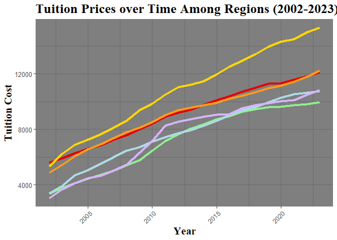

# Loading in Data


```r
newEngland <- read.csv("4YrPublicNewEngland.csv")
newEngland <- newEngland %>%
  filter(Year >= 2002)

national <- read.csv("4YrPublicNational.csv")
national <- national %>%
  filter(Year >= 2002)

middle <- read.csv("4YrPublicMiddle.csv")
middle <- middle %>%
  filter(Year >= 2002)

midwest <- read.csv("4YrPublicMidwest.csv")
midwest <- midwest %>%
  filter(Year >= 2002)

west <- read.csv("4YrPublicWest.csv")
west <- west %>%
  filter(Year >= 2002)

south <- read.csv("4YrPublicSouth.csv")
south <- south %>%
  filter(Year >= 2002)

southwest <- read.csv("4YrPublicSouthwest.csv")
southwest <- southwest %>%
  filter(Year >= 2002)

fourYrPublic <- read.csv("4YrPublicALL.csv")
fourYrPublic <- fourYrPublic %>%
  filter(Year >= 2002)


head(fourYrPublic)
```

```
##   Year National MiddleStates Midwest NewEngland South Southwest West
## 1 2002     4100         5590    4890       5350  3380      3400 3030
## 2 2003     4650         5930    5450       6240  3810      3930 3700
## 3 2004     5130         6290    6070       6880  4130      4690 4120
## 4 2005     5490         6600    6570       7260  4430      5040 4470
## 5 2006     5800         6860    6930       7670  4730      5540 4650
## 6 2007     6190         7250    7380       8120  5020      5980 5030
```
# Vizualizing Data


```r
#Tuition Prices over Time Among Regions
plot <- ggplot(fourYrPublic, aes(Year)) +
  geom_line(aes(y = MiddleStates), color = "#e40000", linetype = "solid", linewidth = 1.5) +
  geom_line(aes(y = Midwest), color = "#FA9C1B", linetype = "solid", linewidth = 1.5) +
  geom_line(aes(y = NewEngland), color = "#FFD700", linetype = "solid", linewidth = 1.5) +
  geom_line(aes(y = South), color = "#90EE90", linetype = "solid", linewidth = 1.5) +
  geom_line(aes(y = Southwest), color = "#ADDAE6", linetype = "solid", linewidth = 1.5) +
  geom_line(aes(y = West), color = "#D6B4Fc", linetype = "solid", linewidth = 1.5) +
  labs(x = "Year", y = "Tuition Cost", title = "Tuition Prices over Time Among Regions (2002-2023)") +
  theme_dark() + theme(
  text = element_text(family = "sans", size = 12),  # Change font to Arial and set size
  title = element_text(family = "serif", face = "bold", size = 16),  # Change title font
  axis.text.x = element_text(family = "sans", angle = 45, hjust = 1),  # Change x-axis text font and rotation
  axis.text.y = element_text(family = "sans", size = 10),  # Change y-axis text font
  legend.text = element_text(family = "serif", size = 8)  # Change legend text font
)

plot
```

<!-- -->


------------------------------------

# Linear Regression for Each Region

## National

```r
national_lm  <- lm( Cost ~ Year, data = national)
summary(national_lm)
```

```
## 
## Call:
## lm(formula = Cost ~ Year, data = national)
## 
## Residuals:
##     Min      1Q  Median      3Q     Max 
## -566.28 -218.86  -47.16  258.98  597.44 
## 
## Coefficients:
##               Estimate Std. Error t value Pr(>|t|)    
## (Intercept) -682196.36   24695.89  -27.62   <2e-16 ***
## Year            343.07      12.27   27.96   <2e-16 ***
## ---
## Signif. codes:  0 '***' 0.001 '**' 0.01 '*' 0.05 '.' 0.1 ' ' 1
## 
## Residual standard error: 365.2 on 20 degrees of freedom
## Multiple R-squared:  0.975,	Adjusted R-squared:  0.9738 
## F-statistic: 781.6 on 1 and 20 DF,  p-value: < 2.2e-16
```

## Middle States

```r
middle_lm  <- lm(Cost ~ Year, data = middle)
summary(middle_lm)
```

```
## 
## Call:
## lm(formula = Cost ~ Year, data = middle)
## 
## Residuals:
##     Min      1Q  Median      3Q     Max 
## -343.20 -153.43  -38.85  185.56  287.99 
## 
## Coefficients:
##               Estimate Std. Error t value Pr(>|t|)    
## (Intercept) -6.334e+05  1.343e+04  -47.15   <2e-16 ***
## Year         3.193e+02  6.675e+00   47.83   <2e-16 ***
## ---
## Signif. codes:  0 '***' 0.001 '**' 0.01 '*' 0.05 '.' 0.1 ' ' 1
## 
## Residual standard error: 198.6 on 20 degrees of freedom
## Multiple R-squared:  0.9913,	Adjusted R-squared:  0.9909 
## F-statistic:  2288 on 1 and 20 DF,  p-value: < 2.2e-16
```

## Midwest

```r
midwest_lm  <- lm(Cost ~ Year, data = midwest)
summary(midwest_lm)
```

```
## 
## Call:
## lm(formula = Cost ~ Year, data = midwest)
## 
## Residuals:
##     Min      1Q  Median      3Q     Max 
## -734.90 -192.20   -3.87  235.30  519.46 
## 
## Coefficients:
##               Estimate Std. Error t value Pr(>|t|)    
## (Intercept) -640147.27   22013.28  -29.08   <2e-16 ***
## Year            322.56      10.94   29.49   <2e-16 ***
## ---
## Signif. codes:  0 '***' 0.001 '**' 0.01 '*' 0.05 '.' 0.1 ' ' 1
## 
## Residual standard error: 325.5 on 20 degrees of freedom
## Multiple R-squared:  0.9775,	Adjusted R-squared:  0.9764 
## F-statistic: 869.6 on 1 and 20 DF,  p-value: < 2.2e-16
```


## New England

```r
newEngland_lm  <- lm(Cost ~ Year, data = newEngland)
summary(newEngland_lm)
```

```
## 
## Call:
## lm(formula = Cost ~ Year, data = newEngland)
## 
## Residuals:
##    Min     1Q Median     3Q    Max 
## -549.0 -107.8    8.9  116.5  465.1 
## 
## Coefficients:
##               Estimate Std. Error t value Pr(>|t|)    
## (Intercept) -9.282e+05  1.607e+04  -57.76   <2e-16 ***
## Year         4.666e+02  7.986e+00   58.43   <2e-16 ***
## ---
## Signif. codes:  0 '***' 0.001 '**' 0.01 '*' 0.05 '.' 0.1 ' ' 1
## 
## Residual standard error: 237.6 on 20 degrees of freedom
## Multiple R-squared:  0.9942,	Adjusted R-squared:  0.9939 
## F-statistic:  3414 on 1 and 20 DF,  p-value: < 2.2e-16
```


## South

```r
south_lm  <- lm(Cost ~ Year, data = south)
summary(south_lm)
```

```
## 
## Call:
## lm(formula = Cost ~ Year, data = south)
## 
## Residuals:
##    Min     1Q Median     3Q    Max 
## -903.9 -270.2 -178.3  457.3  614.8 
## 
## Coefficients:
##               Estimate Std. Error t value Pr(>|t|)    
## (Intercept) -686712.73   31080.10  -22.09 1.60e-15 ***
## Year            344.83      15.44   22.33 1.31e-15 ***
## ---
## Signif. codes:  0 '***' 0.001 '**' 0.01 '*' 0.05 '.' 0.1 ' ' 1
## 
## Residual standard error: 459.6 on 20 degrees of freedom
## Multiple R-squared:  0.9614,	Adjusted R-squared:  0.9595 
## F-statistic: 498.6 on 1 and 20 DF,  p-value: 1.306e-15
```


## Southwest


```r
southwest_lm  <- lm(Cost ~ Year, data = southwest)
summary(southwest_lm)
```

```
## 
## Call:
## lm(formula = Cost ~ Year, data = southwest)
## 
## Residuals:
##     Min      1Q  Median      3Q     Max 
## -662.61  -61.24   75.56  177.79  317.71 
## 
## Coefficients:
##               Estimate Std. Error t value Pr(>|t|)    
## (Intercept) -6.865e+05  1.866e+04  -36.79   <2e-16 ***
## Year         3.449e+02  9.272e+00   37.20   <2e-16 ***
## ---
## Signif. codes:  0 '***' 0.001 '**' 0.01 '*' 0.05 '.' 0.1 ' ' 1
## 
## Residual standard error: 275.9 on 20 degrees of freedom
## Multiple R-squared:  0.9858,	Adjusted R-squared:  0.985 
## F-statistic:  1384 on 1 and 20 DF,  p-value: < 2.2e-16
```

## West

```r
west_lm  <- lm(Cost ~ Year, data = west)
summary(west_lm)
```

```
## 
## Call:
## lm(formula = Cost ~ Year, data = west)
## 
## Residuals:
##    Min     1Q Median     3Q    Max 
## -725.5 -483.9 -221.8  421.8 1226.2 
## 
## Coefficients:
##               Estimate Std. Error t value Pr(>|t|)    
## (Intercept) -749050.00   42285.23  -17.71 1.08e-13 ***
## Year            375.97      21.01   17.89 8.93e-14 ***
## ---
## Signif. codes:  0 '***' 0.001 '**' 0.01 '*' 0.05 '.' 0.1 ' ' 1
## 
## Residual standard error: 625.2 on 20 degrees of freedom
## Multiple R-squared:  0.9412,	Adjusted R-squared:  0.9383 
## F-statistic: 320.2 on 1 and 20 DF,  p-value: 8.932e-14
```


# Performing Two-Sample T-Tests


## Southwest v West


```r
#Southwest v West
# Null : Southwest = West
# Alternative: Southwest < West 

 #(beta1_{group1} - beta1_{group2})/sqrt(se(beta1__{group1})^2 + se(beta1_{group2})^2)

t = (344.9 - 375.97) / sqrt((9.272)^2 + (21.01)^2)
t
```

```
## [1] -1.35293
```
Test Statistic = -1.353

Degrees of Freedom= 20


```r
#Find P-value
p = 2*pt(t, 20) 
p = p * 15 # Bonferonni adjustment
p
```

```
## [1] 2.867632
```
P-value : 1

*Not significantly different*

## **West v New England**


```r
#West vs New England
# Null : West = New England
# Alternative: West < New England

t = (375.97- 466.6) / sqrt((21.01)^2 + (7.986)^2)
t
```

```
## [1] -4.032198
```
Test Statistic = -4.03

Degrees of Freedom= 20


```r
#Find P-value
p = 2*pt(-4.03, 20) 
p = p * 15  #Bonferroni adjustment 
p
```

```
## [1] 0.009837943
```
P-value = 0.00984

**SIGNIFICANTLY DIFFERENT**

Therefore we reject the null hypothesis. There is sufficient evidence to support the claim that the West is increasing a statistically lower rate than New England.


## Midwest v West


```r
# Midwest vs West
# Null :Midwest = West 
# Alternative: Midwest < West 

t = (322.56 - 375.97) / sqrt((10.94)^2 + (21.01)^2)
t
```

```
## [1] -2.254764
```
Test Statistic = -2.255

Degrees of Freedom = 20


```r
#Find P-value
p = 2*pt(t, 20)
p = p * 15  #Bonferroni adjustment 
p
```

```
## [1] 0.5327194
```
P-value = 0.532

*Not significantly different* 

## **Southwest v New England**


```r
#Southwest vs New England
# Null : Southwest = New England
# Alternative: Southwest < New England

t = (344.9- 466.6) / sqrt((9.272)^2 + (7.986)^2)
t
```

```
## [1] -9.945181
```
Test Statistic = -9.945

Degrees of Freedom = 20


```r
#Find P-value
p = 2*pt(t, 20) 
p = p * 15 # Bonferonni adjustment
p
```

```
## [1] 5.204839e-08
```
P-value = 5.205e-08

**SIGNIFICANTLY DIFFERENT**

Therefore we reject the null hypothesis. There is sufficient evidence to support the claim that the Southwest is increasing a statistically lower rate than New England.


##  Midwest v Southwest

```r
#Midwest vs Southwest
# Null : Midwest = Southwest
# Alternative: Midwest < Southwest

t = (322.56 - 344.9) / sqrt((10.94)^2 + (9.272)^2)
t
```

```
## [1] -1.557812
```
Test Statistic = -1.56

Degrees of Freedom = 20


```r
#Find P-value
p = 2*pt(t, 20) 
p = p * 15 # Bonferonni adjustment
p
```

```
## [1] 2.024423
```
P-value = 1

*Not significantly different*


## South v West


```r
#South v West
# Null : South = West
# Alternative: South < West

t = (344.83 - 375.97) / sqrt((15.44)^2 + (21.01)^2)
t
```

```
## [1] -1.194328
```
Test Statistic = -1.194

Degrees of Freedom = 20


```r
#Find P-value
p = 2*pt(t, 20) 
p = p * 15 # Bonferonni adjustment
p
```

```
## [1] 3.694838
```
P-value = 1

*Not significantly different* 

## South v Southwest

```r
#South vs Southwest
# Null : South = Southwest
# Alternative: South < Southwest

t = (344.83 - 344.9) / sqrt((9.272)^2 + (15.44)^2)
t
```

```
## [1] -0.003886709
```
Test Statistic = -0.00389

Degrees of Freedom = 20


```r
#Find P-value
p = 2*pt(t, 20) 
p = p * 15 # Bonferonni adjustment
p 
```

```
## [1] 14.95406
```
P-value = 1

*Not significantly different*


## **South v New England**

```r
#South vs New England
# Null : South = New England
# Alternative: South < New England

t = (344.83- 466.6) / sqrt((15.44)^2 + (7.986)^2)
t
```

```
## [1] -7.005107
```
Test Statistic = -7.005

Degrees of Freedom = 20


```r
#Find P-value
p = 2*pt(t, 20) 
p = p * 15 # Bonferonni adjustment
p 
```

```
## [1] 1.276147e-05
```
P-value = 1.276e-05

**SIGNIFICANTLY DIFFERENT**

Therefore we reject the null hypothesis. There is sufficient evidence to support the claim that the South is increasing a statistically lower rate than New England.

## Midwest v South

```r
#Midwest vs South
# Null :  Midwest = South
# Alternative: Midwest < South

t = (322.56 - 344.83) / sqrt((10.94)^2 + (15.44)^2)
t
```

```
## [1] -1.176879
```
Test Statistic = -1.177

Degrees of Freedom = 20


```r
#Find P-value
p = 2*pt(t, 20) 
p = p * 15 # Bonferonni adjustment
p
```

```
## [1] 3.795913
```
P-value = 1

*Not significantly different*


## South v Middle States

```r
#Middle States vs South
# Null :Middle States  = South
# Alternative:Middle States  < South

t = (319.3 - 344.83) / sqrt((6.675)^2 + (15.44)^2)
t
```

```
## [1] -1.517737
```
Test Statistic = -1.518

Degrees of Freedom = 20


```r
#Find P-value
p = 2*pt(t, 20) 
p = p * 15 # Bonferonni adjustment
p
```

```
## [1] 2.170947
```
P-value = 1

*Not significantly different* 


## **Midwest v New England**

```r
# Midwest vs New England
# Null : Midwest = New England
# Alternative: Midwest < New England

t = (322.56 - 466.6) / sqrt((7.986)^2 + (10.94)^2)
t
```

```
## [1] -10.63439
```
Test Statistic = -10.634

Degrees of Freedom = 20


```r
#Find P-value
p = 2*pt(t, 20) 
p = p * 15 # Bonferonni adjustment
p
```

```
## [1] 1.670539e-08
```
P-value = 1.671e-08

**SIGNIFICANTLY DIFFERENT**

Therefore we reject the null hypothesis. There is sufficient evidence to support the claim that the Midwest is increasing a statistically lower rate than New England.

## Middle States v West

```r
#Middle States v West
# Null : Middle States = West
# Alternative: Middle States < West

t = (319.3 - 375.97) / sqrt((21.01)^2 + (6.675)^2)
t
```

```
## [1] -2.570668
```
Test Statistic = -2.57

Degrees of Freedom = 20


```r
#Find P-value
p = 2*pt(t, 20) 
p = p * 15 # Bonferonni adjustment
p
```

```
## [1] 0.2737
```
P-value = 0.2737

*Not significantly different* 

## Middle States v Southwest


```r
#Middle States v Southwest
# Null : Middle States = Southwest
# Alternative: Middle States < Southwest
 #(beta1_{group1} - beta1_{group2})/sqrt(se(beta1__{group1})^2 + se(beta1_{group2})^2)

t = (319.3 - 344.9) / sqrt((9.272)^2 + (6.675)^2)
t
```

```
## [1] -2.240743
```
Test Statistic = -2.241

Degrees of Freedom = 20


```r
#Find P-value
p = 2*pt(t, 20) 
p = p * 15 # Bonferonni adjustment
p
```

```
## [1] 0.5482888
```
P-value = 0.548

*Not significantly different*

## **Middle States v New England**

```r
#Middle States v New England
# Null : Middle States = New England
# Alternative: Middle States < New England
 #(beta1_{group1} - beta1_{group2})/sqrt(se(beta1__{group1})^2 + se(beta1_{group2})^2)

(319.3 - 466.6) / sqrt((7.986)^2 + (6.675)^2)
```

```
## [1] -14.15223
```
Test Statistic = -7.387

Degrees of Freedom = 20


```r
#Find P-value
2*pt(-7.387, 20)
```

```
## [1] 3.904933e-07
```
P-value = 1.745E-08

**SIGNIFICANTLY DIFFERENT**

Therefore we reject the null hypothesis. There is sufficient evidence to support the claim that the Middle States are increasing a statistically lower rate than New England.

## Middle States v Midwest

```r
#Middle States v Midwest
# Null : Middle States = Midwest
# Alternative: Middle States < Midwest
 #(beta1_{group1} - beta1_{group2})/sqrt(se(beta1__{group1})^2 + se(beta1_{group2})^2)

(319.3 - 322.56) / sqrt((10.94)^2 + (6.675)^2)
```

```
## [1] -0.2543778
```
Test Statistic = -2.007

Degrees of Freedom = 20


```r
#Find P-value
2*pt(-2.007, 20)
```

```
## [1] 0.05845728
```
P-value = 0.0530

*Not significantly different*


# Findings

After completing this analysis, I found that :


- West vs New England
- Southwest vs New England
- South vs New England
- Midwest vs New England
- Middle States vs New England 

are all significantly different using a p-value of 0.01.


# Future Investigations

- Look into the cause of why New England is rising at a higher rate than other regions.

# Tableau Visualizations

[Tableau Dashboard](https://public.tableau.com/views/U_S_RegionTuitionIncreaseComparison/Tuition?:language=en-US&publish=yes&:display_count=n&:origin=viz_share_link)
